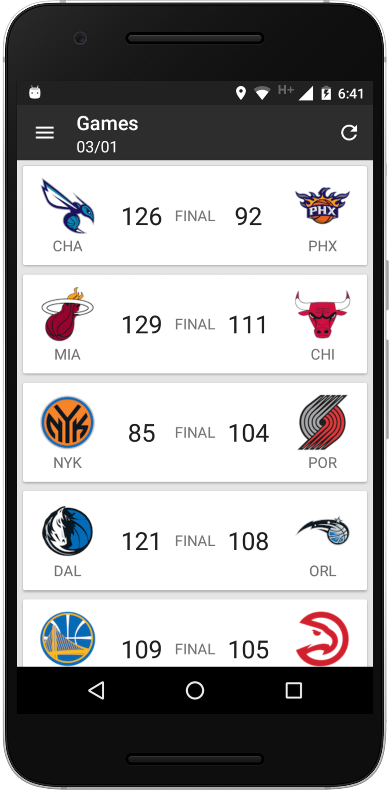
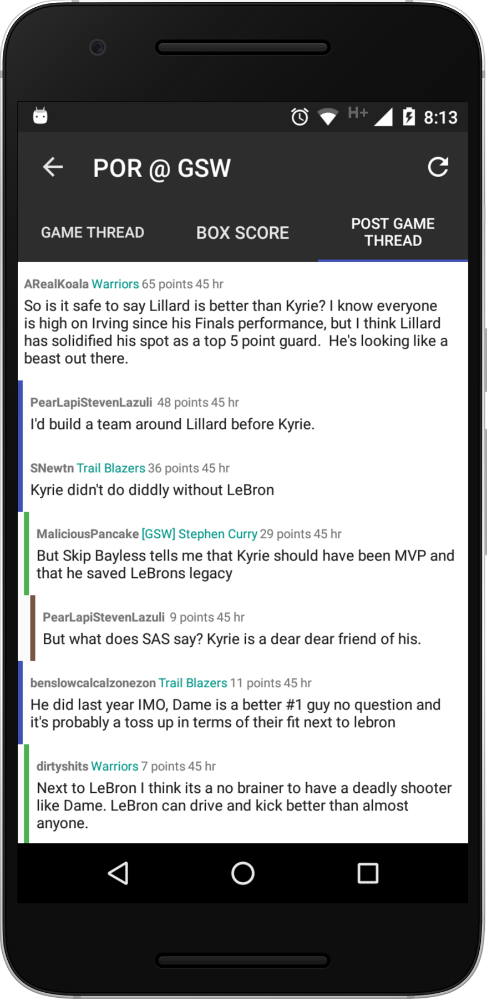
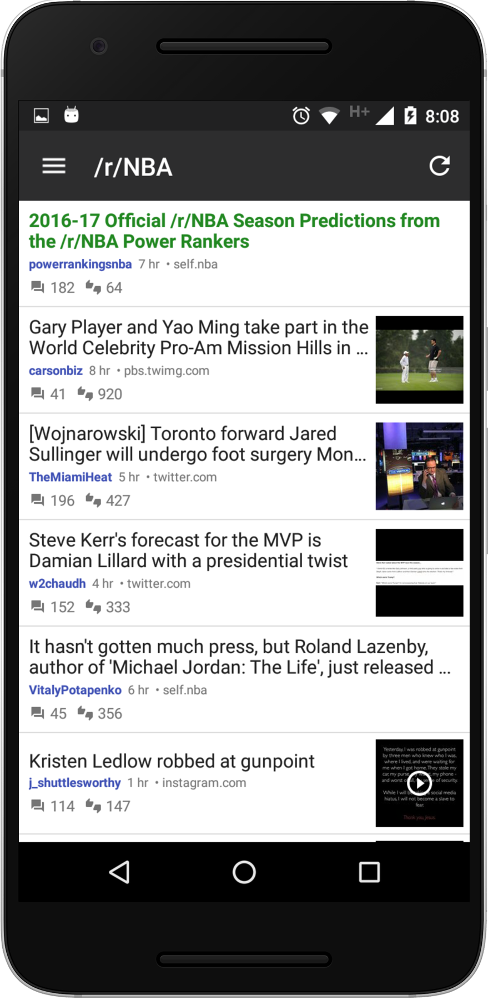
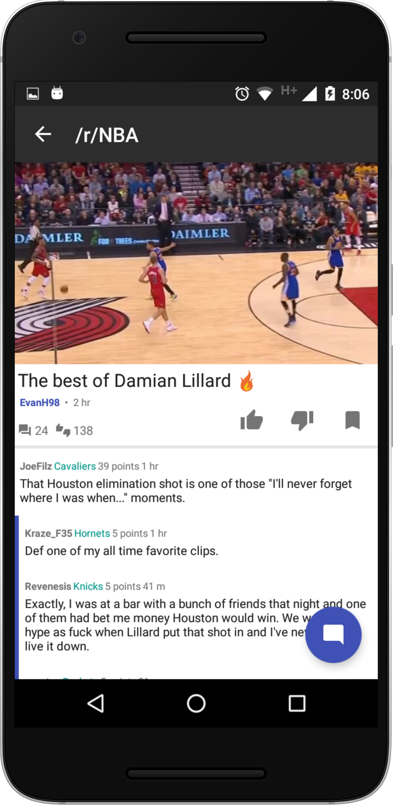

# NBA Android App

Android app for NBA fans. Features live scores, highlights, alerts and Reddit integration for discussions.

## Features
* Real-time scores and box scores
* [/r/NBA](https://www.reddit.com/r/nba) live and post game discussion threads
* [/r/NBA](https://www.reddit.com/r/nba) and all team subreddits threads
* Push notifications when games are close/interesting
* Push notifications when games begin/end
* User-submitted highlight videos
* Standings

## Screenshots

[More screenshots](http://imgur.com/a/4h75K)

## Downloads

A public Play Store version will not be available until a stable release is out, but there is an alpha version published, contact me to request an invitation.

Pre-release APK is available [here](https://github.com/jorgegil96/All-NBA/releases).

## Contributing  

Fix a bug, add a new feature or make the code prettier!

### Steps to contribute:
1. Fork the repository
2. Look at the list of [open issues](https://github.com/jorgegil96/All-NBA/issues), pick one or create a new one (this can be for a bug or wanted feature)
3. Write code and document it, look at the code around you and try to follow the style and conventions used. An MVP architecture is used throughout the app.
4. Write unit tests (if possible)
5. Run ALL tests by executing `./gradlew test`
6. Send a pull request

Some resources that you might find useful:
* [JRAW](https://github.com/thatJavaNerd/JRAW): the Java Reddit API Wrapper, used throughout the application for integrating any reddit functionalities   

### What if I don't code?  

You can contribute by reporting bugs, suggesting new features or translating the app!
